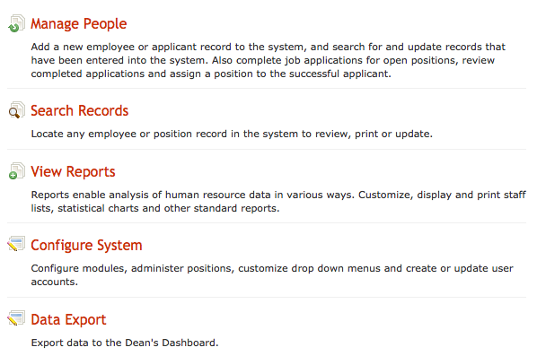
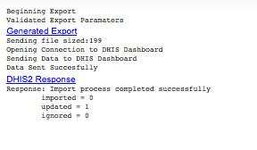

Data Export to DHIS in iHRIS F.A.S.T
================================================

Exporting The Data
^^^^^^^^^^^^^^^^^^

The home page of iHRIS F.A.S.T. has a new menu item "Data Export" to handle data export to the Dean's Dashboard/DHIS2. 

 

Clicking on this link will take you to a page showing all of the available data exports. 

 

Clicking on one of the data exports will take you to a page where the data is posted to DHIS2 and the response is shown. 

 

Linking The Data
^^^^^^^^^^^^^^^^

The data in iHRIS F.A.S.T. and DHIS2 need to be linked together in order to successfully share information. 

Training Program
~~~~~~~~~~~~~~~~

Each member of the Training Program database list should be linked to the DHIS2 data element as follows: 
.. image:: images/Training program.png
    :align: center

 

Student Status
~~~~~~~~~~~~~~

Each member of the Student Status database list should be linked to the DHIS2 data element as follows: 
.. image:: images/Student status.png
    :align: center

 

DHIS2 Source Data
^^^^^^^^^^^^^^^^^

The DHIS2 metadata on organisational units and data elements has been imported into iHRIS. This is read only data which you can view by looking at the "Administer Database" page: 
.. image:: images/Admin db.png
    :align: center

 

Looking at the Organisational Units you will have something like: 
.. image:: images/Org units.png
    :align: center

 

Looking at the Data Elements you will have something like: 
.. image:: images/Data element.png
    :align: center

 

Data Relationship
^^^^^^^^^^^^^^^^^

The data used to generate the report (# of students by student status and program) is based on a relationship built on the forms illustrated here: Note that the primary form in the relationship is student_app and that the person form is only included in the diagram for illustrative purposes as it is not needed in the actual relationship. 

.. image:: images/Fast student app.gif
    :align: center

 

 

iHRIS Programming Details
^^^^^^^^^^^^^^^^^^^^^^^^^

What we have done is to export the metadata from DHIS2 as an .xml file and setup two forms in iHRIS, data_element and unit, that read the metadata file and populate the forms from the dataElements and organisationUnits. Here is the `code <http://bazaar.launchpad.net/~intrahealth+informatics/ihris-student-tracking/trunk/view/head:/modules/OrgUnits/OrgUnits.xml>`_ that does that. Specifically look at at lines 95-223. 

The DHIS2 metadata file that it is reading from can be seen `here <http://bazaar.launchpad.net/~intrahealth+informatics/ihris-student-tracking/trunk/view/head:/modules/OrgUnits/dashboard_metadata/Export.xml>`_. Where we have used the [[Technical Overview: Form Storage -- XML|XML form storage mechanism]] which let's you populate the form data using XPATH queries on an XML document. 

The report which contains the data (# of students disaggregated by application status and training program ) is defined `here <http://bazaar.launchpad.net/~intrahealth+informatics/ihris-student-tracking/trunk/view/head:/modules/DHIS2_StudentStatus/CustomReports-full-student_status.xml>`_ and you can see how the data is linked together more clearly `here <http://wiki.ihris.org/wiki/Data_Export_to_DHIS_in_iHRIS_F.A.S.T#Data_Relationship>`_. 

The needed .dxf file with the dataValueSets is produced using an xslt. This XSLT is contained in the report view itself (see starting on line 274 of the CustomReports-full-student_status.xml) above. A `copy of the XSL is here <http://bazaar.launchpad.net/~intrahealth+informatics/ihris-student-tracking/trunk/view/head:/modules/DHIS2_StudentStatus/sources/student_status.xsl>`_ so we can view/copy it easier, 

  There is also a page that I setup that will handle multiple exports of iHRIS to DHIS. Here you can see where curl is used to connect to dhis2 and submit the data. The response from DHIS2 is processed and displayed on the web page. The PHP code is `here <http://bazaar.launchpad.net/~intrahealth+informatics/ihris-student-tracking/trunk/view/head:/modules/OrgUnits/lib/iHRIS_DHIS_DashboardSubmit.php>`_. It reads in magic data to get the connection details to DHIS2 as well as define the report view and transform to use. You can see the magic data defined on lines 33-63 in the OrgUnits.xml file referenced above. A link to the page has been added to the `index.html page <http://bazaar.launchpad.net/~intrahealth+informatics/ihris-student-tracking/trunk/view/head:/templates/en_US/index.html>`_.

[[Category:Archived Pages]]
