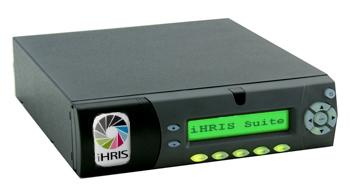

Linux iHRIS Compared to Windows iHRIS
=====================================

The iHRIS Suite is available on two platforms: Linux (Ubuntu) and Windows XP. This information sheet compares the two versions to help when deciding which version to install. 

In general, we recommend that you choose the Linux version for installation:

* where a system administrator is available to manage the computer and supporting software;
* where multiple users will be accessing iHRIS over a network;
* and where reliability, security and data protection are high-priority concerns, such as in a centralized office of the Ministry of Health.

We recommend that you choose the Windows version for installation in decentralized locations, such as a hospital, health facility or local government office, where technical support may not be as available, understanding that there are greater security and data quality risks associated with the Windows version. In that situation, we recommend that iHRIS be installed on a Windows computer that is physically secure from unauthorized access, that is not used for any purpose other than running iHRIS and that access to iHRIS be limited to as few users as practicable.

Note that both versions of iHRIS may be accessed via an Internet or local area network connection, if available, or may be accessed via the desktop as an "offline" system.

Support and Administration
^^^^^^^^^^^^^^^^^^^^^^^^^^

The Linux version of iHRIS requires that several pieces of software (Apache, PHP, MySQL, etc.) be installed to support iHRIS. While all of this software is freely available for download, installing and maintaining the software does assume that a system administrator with some expertise in these technologies is available to manage the server and the required software.

The Windows version can be installed on any computer running Windows XP. All of the supporting software (such as the MySQL database) are included in the Windows installation package and do not have to be installed separately. The Windows version does not require technical expertise to maintain. However, some knowledge of MySQL is required to perform more advanced database maintenance tasks.

If basic ICT support is available you may consider the iHRIS appliance model.  The appliance is a small computer with no monitor, mouse, or keyboard but instead has only a small LCD screen and few command buttons.  The cost as of this writing for appliance, UPS, and flash drive back-up solution is ~$550 USD.  The appliance comes pre-loaded with all the Linux software necessary to run the iHRIS suite as well as customizations requested by the customer and, if available in electronic format for import, the customer’s data.  The ICT support must configure the appliance on their LAN following basic instructions provided and direct users to the appropriate URL.  Any user on the LAN may then use the iHRIS suite with an internet browser.  The HRIS appliance model offers many of the advantages of the full Linux version at a very low cost.  It is preferable to the Windows version if security and viruses are an issue on your network.

Reliability
^^^^^^^^^^^

To support iHRIS, many background processes such as caching forms and reports must run. The Linux version captures the output of these processes so that the system administrator can view it later if any errors occur. In the Windows version of iHRIS there is no way to capture this output, which makes tracking down and solving errors more difficult on Windows. This could make the Windows version more unreliable when trying to solve issues with data quality or software bugs.

Because iHRIS and its supporting software were written to run on a Linux problem, performance and speed of Linux iHRIS will be better than Windows iHRIS. For the same reasons, Linux iHRIS will be more stable and less prone to crashes than Windows iHRIS.

If the Windows version is installed and runs on a computer where other intensive programs are running, such as an email program or word processor, Windows iHRIS may slow the performance of the computer.

Security
^^^^^^^^

In general, the Linux version of iHRIS will be more secure than the Windows version.

Linux iHRIS is designed to support multiple users, each accessing iHRIS with a separate username and password. Each user is assigned a role that limits what data the user can see and change in iHRIS. Most Windows computers don't have multiple users. If a separate Windows user account is not created for each user of the Windows computer, then they would all have the same access to iHRIS.

Linux servers are usually stored more securely as well, such as in a locked server closet. On Windows the database passwords are stored in the Windows registry, which may be seen by anyone with physical access to the computer. If Windows iHRIS is installed on a desktop computer that is not physically secure, such as on someone's desk, then the iHRIS database will be more at risk of unauthorized access, deletion or corruption.

Linux servers are generally less prone to computer viruses than Windows computers. A Windows computer running iHRIS that is also connected to the Internet (via an email program, for example) is more vulnerable to hardware failure and data loss from a computer virus than a Linux server.

