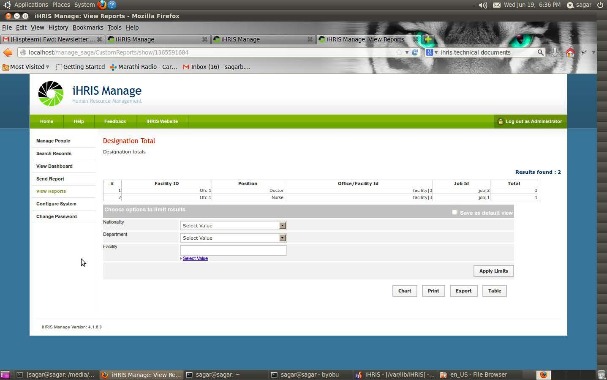
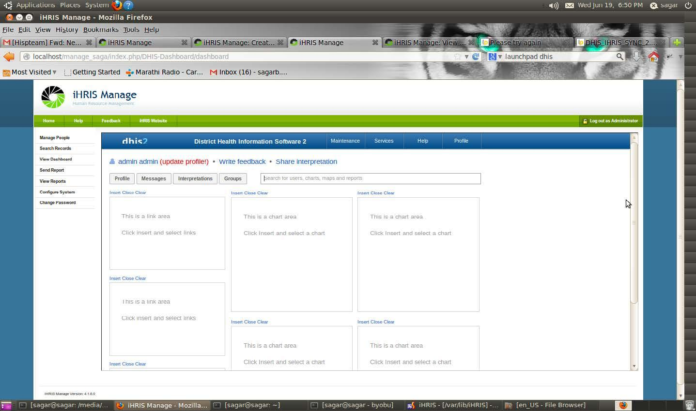
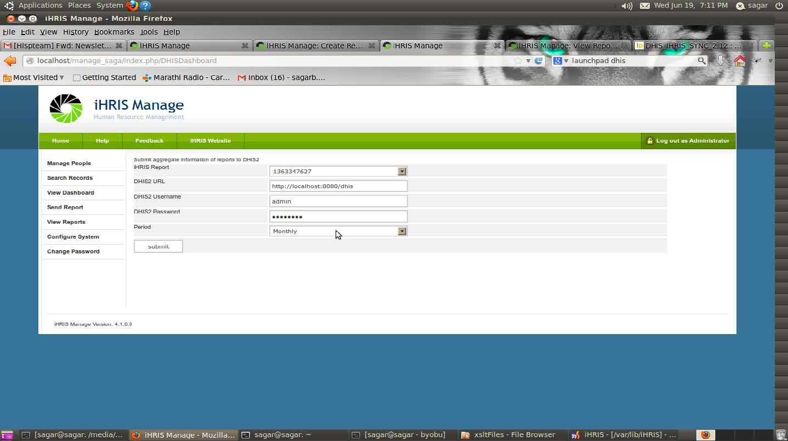
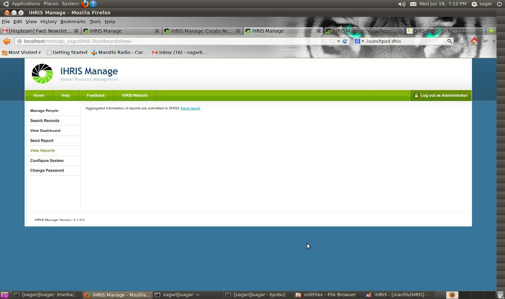
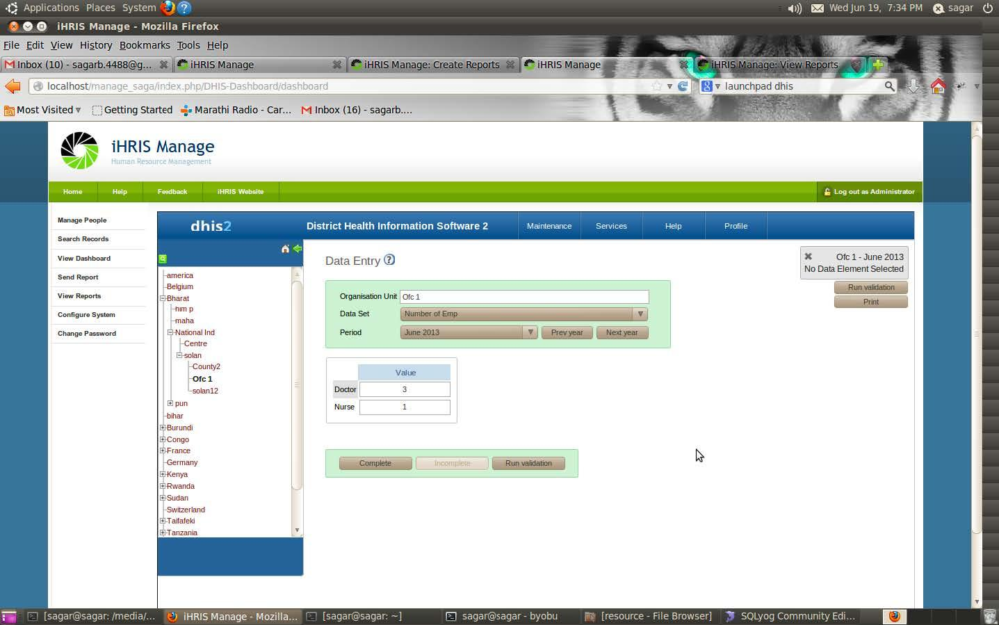

Integrating the DHIS2 Dashboard
================================================

This document describes the work flow for iHRIS-DHIS Integration that is being developed for iHRIS India.  **Warning:** The code is in development and is subject to change.

Source Code Location
^^^^^^^^^^^^^^^^^^^^
https://code.launchpad.net/~sagarb-4488/indian-ihris/iHRIS-DHIS

* Start iHRIS Application and login
* Go to: Configure Module -> iHRIS Common -> enable 'DHIS Dashboard' module
* Create a Designation (number of health-workers by position) report
  

* Add xslt format in Export option of report view of newly created Designation report. (For different period id like monthly, yearly depends on the format which will be accepted in DHIS dxf2 module)  Path to xslt files: (......./ihris-common/modules/DHIS-Dashboard/resource/xsltFiles/*)
* Checkout DHIS code from location (https://code.launchpad.net/~dhis2-devs-core/dhis2/DHIS_IHRIS_SYNC_2.12) and build it using india-pom.xml in (.../dhis2/dhis-web/dhis-web-portal/india-pom.xml)
* Add link to dhis application to view dashboard in file: (..../ihris-common/modules/DHIS-Dashboard/templates/en_US/dashboard.html) eg - "http://localhost:8080/dhis/dhis-web-dashboard-integration/index.action"
* Set cookies for dashboard and automatic login in dhis application in file ihris-common/modules/DHIS-Dashboard/lib/iHRIS_PageDashboard.php.  Example:
  

.. code-block:: php

     $cookie = explode('=', $cookie); set_cookie('JSESSIONID', $cookie[1], time() + 6000, '/dhis', 'localhost',0); 

  Note: Need to make it user customizable in future.
  

* Set path to store file xml file generated from report and to send to dhis

  * Go to file ihris-common/modules/DHIS- Dashboard/lib/I2CE_CustomReport_Display_DefaultDHISDashboard.php
  * Give path to create file and store xml output of report //enter data into file
  

.. code-block:: php

    $fp = fopen(".../path/output.xml", "w");
    

* Enter ihris login username and password in the file ihris-common/modules/DHIS-Dashboard/lib/I2CE_CustomReport_Display_DefaultDHISDashboard.php:
  

.. code-block:: php

    $login_submission = array( 'username' => "i2ce_admin", 'password' => "root" );
    

  Note: Need to make it user customizable in future.
* Assign Data Elements to Data Set and Data set to organization unit in DHIS application.
* Data Elements and Organization units are created in DHIS automatically once we send our first report
* After that only updated organization unit’s information is sent to DHIS. 13. To send data element for now we are writing queries in ihris-common/modules/DHIS- Dashboard/lib/I2CE_CustomReport_Display_DefaultDHISDashboard.php.
  Note: Need to make it user customizable in future.
* To send Data

  * Click on send report after selecting period
  * :

  * Next screen will appear like this
  * :

  * The data will then appear in Data entry screen for that month in DHIS application.
  * :

* Once we have that information in DHIS we can generate reports in DHIS.
Note: Some extra code (not necessary code) is there in DHIS-Dashboard module for DataElement and DataSet (Considering this might be useful in future)

[[Category:India]]
