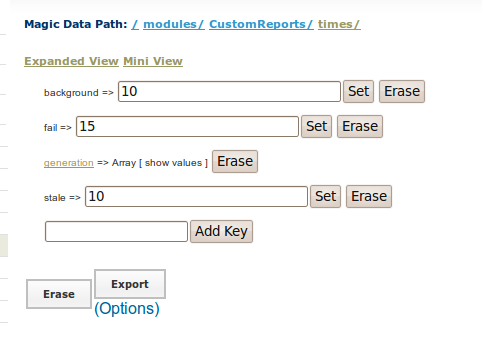

Configuring Report Generation Timing
================================================

Custom Reports are cached on a regular basis when your site is accessed.  There are a few settings you can override in your site configuration file to change this behavior.  You can also see how to [[Turn Off Background Processes]] if you wish to not have the form caches update automatically.

See also [[Generate Reports Automatically]]

 **This page is a work in progress**

Configuration Settings
^^^^^^^^^^^^^^^^^^^^^^
; /modules/CustomReports/times/background
: Default value: **10**
: This determines how much time in minutes that must pass before the background process starts to cache the reports if they are stale.  This just causes the background process to spawn, the process itself determines what needs to be updated based on the other timing settings.  If you set this to 0 then the background process will never start.  When Custom Reports are cached, then any required form caches are also run (if they are stale) before the report.  This doesn't mean that the caches will be run every X minutes, but if X minutes have passed the next time someone access the site the background process will be launched.

Configuration Example
^^^^^^^^^^^^^^^^^^^^^

.. code-block:: xml

    <configurationGroup name="CustomReports_times" path="/modules/CustomReports/times">
      <displayName>Times</displayName>
      <configuration name="stale">
        <displayName>Stale Time</displayName>
        <description>The time (in minutes) after which reports are considered stale. If less than or equal to zero 
          then it is always considered stale
        </description>
        <value>10</value>
      </configuration>
      <configuration name="stale_by_report" values="many" type="delimited">
        <displayName>Stale Time</displayName>
        <description>The time (in minutes) after which a specific report is considered stale. Overides the value in 
          times/stale. If less than or equal to zero then it is always considered stale
        </description>
        <value>report_name:10</value>
      </configuration>
      <configuration name="background">
        <displayName>Background Time</displayName>
        <description>The time (in minutes) after which to launch the backround process to generate reports. If less 
          than or equal to zero we do not launch it.
        </description>
        <value>10</value>
      </configuration>
      <configuration name="fail">
        <displayName>Fail Time</displayName>
        <description>The time (in minutes) after which a report is considered to have failed generation</description>
        <value>15</value>
      </configuration>
    </configurationGroup>
    

Magic Data Browser
^^^^^^^^^^^^^^^^^^
We can use to the Magic Data Browser to change this.  **WARNING** this is a dangerous tool as you can really destroy your system -- think of RegEdit under Windows.

Suppose we want to change
 /modules/CustomReports/times/background
to be 60 minutes.

Go to

* Configure System
* Browse Magic Data
* I2CE
* modules
* CustomReports
* times

Your screen should look like this:

Now, change the line where it says "background" from "10" to "60" and click the "Set" button next to it.

[[Category:Custom Reporting]][[Category:Review2013]]
