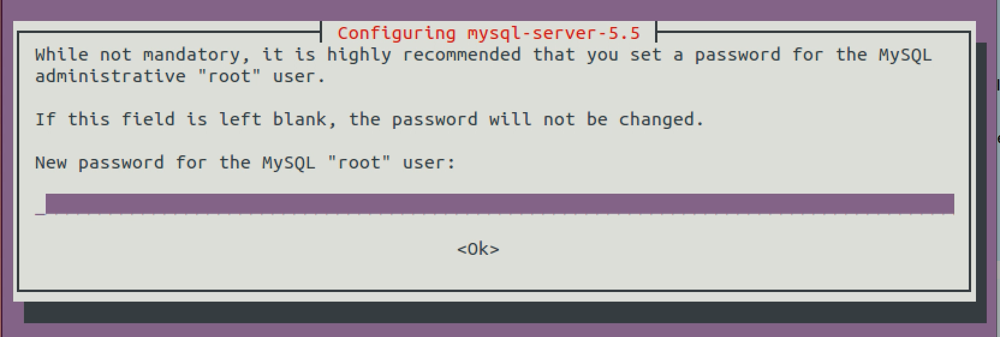
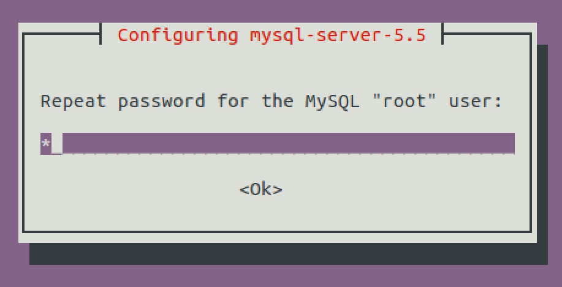
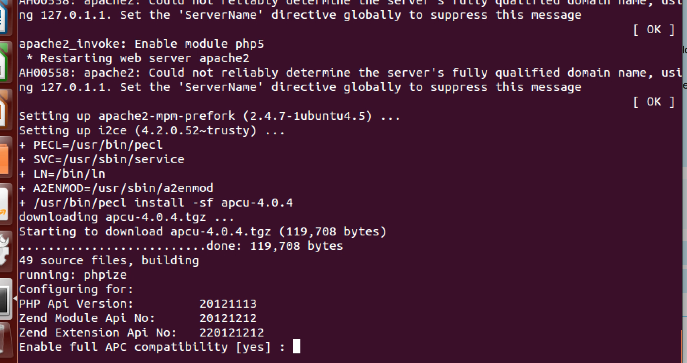
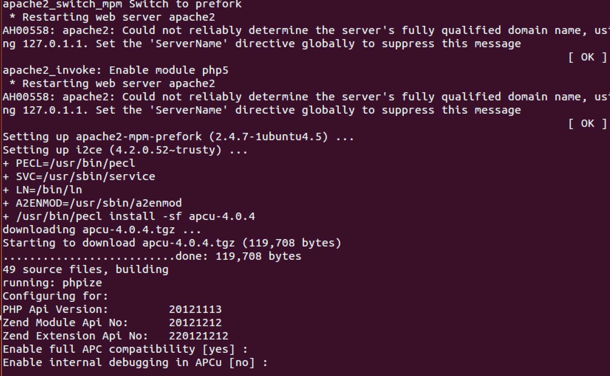
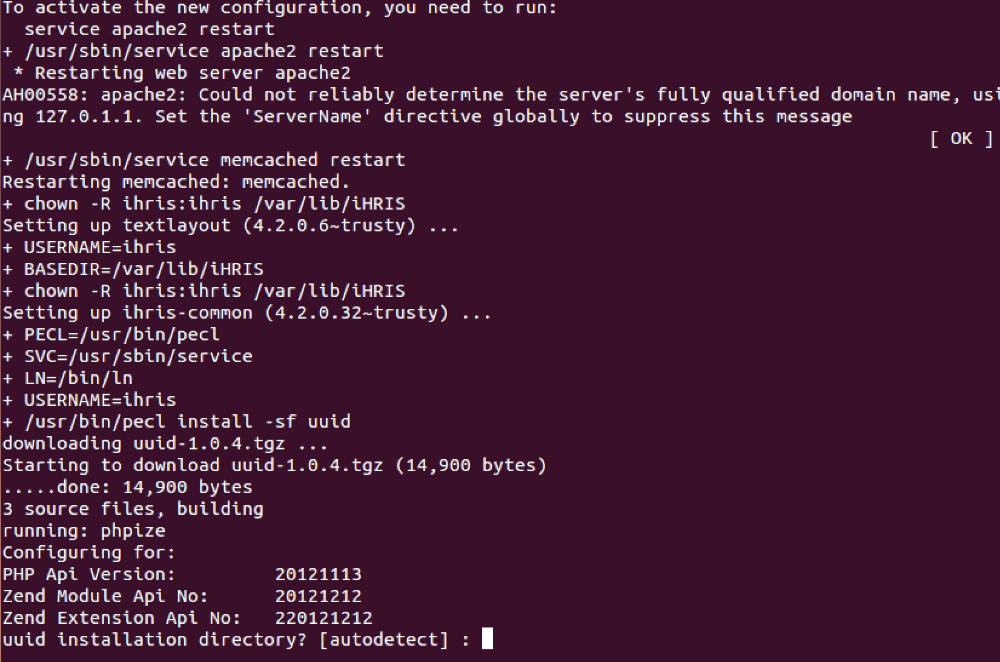
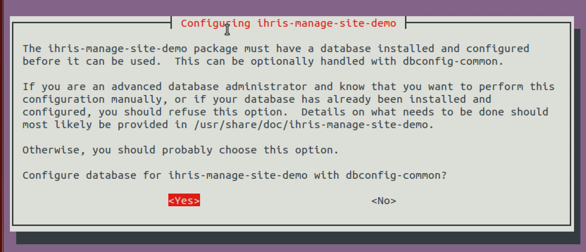
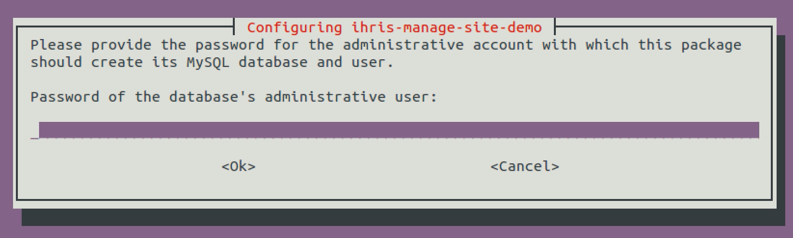
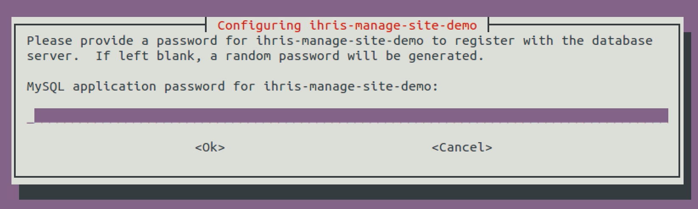

Installing iHRIS 4.2
====================

Linux Ubuntu Installation - 4.2
^^^^^^^^^^^^^^^^^^^^^^^^^^^^^^^

iHRIS Installation starting version 4.2.0 will be through debian packages. This (<small>click URL</small>)  `Youtube Video <https://youtu.be/_tCueReOgNs>`_  complements this wiki article.

Packages
^^^^^^^^

iHRIS has been packaged using different names

I2CE
~~~~

* **i2ce** : This is the package name for I2CE core code.

iHRIS Manage
~~~~~~~~~~~~

iHRIS Manage which is the package for managing health worker information has two packages:

* **ihris-manage** : This is the base iHRIS Manage package on which all iHRIS Manage sites depend on.
* **ihris-manage-site** : This package installs an empty iHRIS Manage site
* **ihris-manage-site-demo** : This installs iHRIS Manage that comes bundled with testing/demo data

iHRIS Qualify
~~~~~~~~~~~~~

iHRIS Qualify which is the package for managing registration and licensing of health workers 

* **ihris-qualify** : This is the base iHRIS Qualify package on which all iHRIS Qualify sites depend on.
* **ihris-qualify-site** : Package that installs a blank iHRIS Qualify site
* **ihris-qualify-site-demo** : package that comes with testing/demo data

iHRIS Train
~~~~~~~~~~~

iHRIS Train: an iHRIS package for managing Pre-service and In-service trainings.

* **ihris-train** : This is the base iHRIS Train package on which all the iHRIS Train sited depend on.
* **ihris-train-site** : installs an empty iHRIS Train site
* **ihris-train-site-demo** : installs iHRIS Train that comes bundled with testing/demo data
 

Installation Steps
^^^^^^^^^^^^^^^^^^

* Add the iHRIS PPA to software sources <pre>$ sudo add-apt-repository ppa:openhie/release</pre>
* Update the software sources lists <pre>$ sudo apt-get update</pre>
* Install iHRIS Packages. <pre>$ sudo apt-get install PACKAGE_NAME</pre>During the installation process there will be prompts for different settings and configurations including database configurations. The details are in the section below.

  * Running the command <pre>$ sudo apt-get install ihris-manage</pre> will also install i2ce, ihris-common and textlayout on which it depends
  * Running the command <pre>$ sudo apt-get install ihris-manage-site-demo</pre> on a clean install (where iHRIS has never been installed before) will install i2ce, textlayout, ihris-common, ihris-manage and the ihris-manage-site-demo site.
* To access the installed site open the browser and visit <pre>http://localhost/iHRIS/PACKAGENAME</pre>

Configuration Prompts During Installation
~~~~~~~~~~~~~~~~~~~~~~~~~~~~~~~~~~~~~~~~~

Database
--------

You will be prompted to set the **database root user password** . This is the password you use when accessing MySQL with username root in (<code>mysql -u root -p</code>)

This first prompt is for setting the password. Type the password and press Enter when you are done.

 

Then you will be required to confirm the password. Re-type the password you typed previously.

APCU
----

In configuring APCu (which is required for caching), just leave the default values by pressing enter at the prompt.

First you will be asked for compatibility

And then to enable Debugging.

UUID
----
When installing iHRIS sites (such ihris-manage-site, ihris-qualify-site, ihris-manage-site-demo, etc) you will be prompted for setting UUID installation directory.

As said earlier, just leave the default value [autodetect] and **press Enter** 

Installation Example
~~~~~~~~~~~~~~~~~~~~

ihris-manage-site-demo
----------------------
To install a demo site for iHRIS Manage run the command below:

.. code-block::

    sudo apt-get install ihris-manage-site-demo

During installation you will be asked for the password for setting up the database.

In the first prompt you enter the **MySQL *root user password** *  which you set earlier for root user

Then, you will have to set the password for the *iHRIS user*  that will be administering this database. Remember, this is the password you will be using when accessing the system using the *i2ce_admin user*  and when prompted to update the site from the browser.

Once the installation has finished, you can visit the site by entering the address  <code>http://localhost/iHRIS/ihris-manage-site-demo</code> on the browser.

