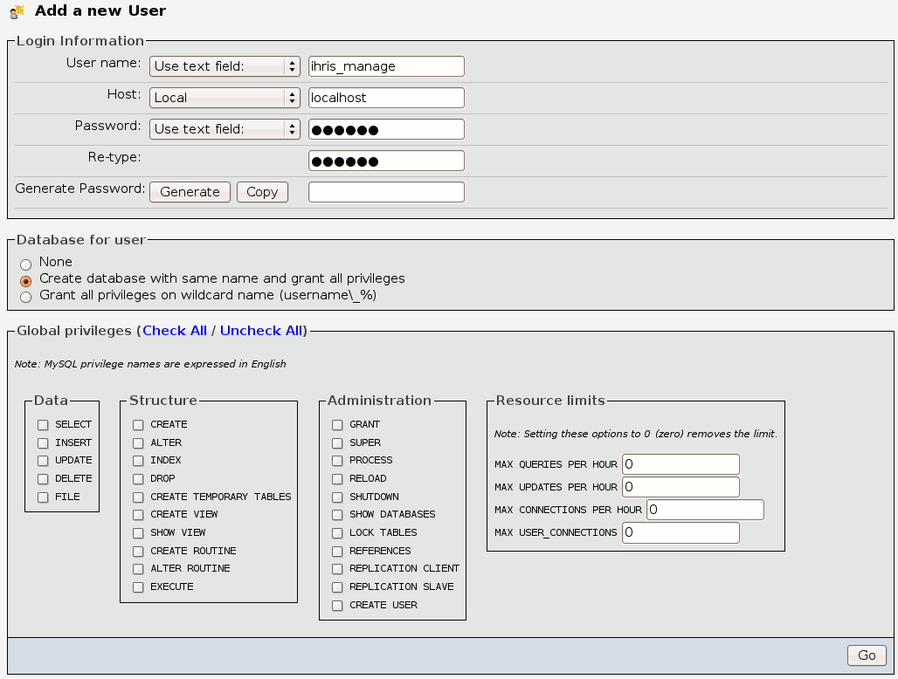

Linux (Ubuntu) Installation - 3.1
=================================

This page contains installation instructions on installing iHRIS version 3.1 manually.
{{otherversions|Linux (Ubuntu) Installation}}

Getting Ready
^^^^^^^^^^^^^

Here are instructions for installing the iHRIS Suite on an Linux (Ubuntu) system.  If you need help installing Ubuntu you may want to take a look at
these directions for installing a  `Server <http://www.howtoforge.com/perfect-server-ubuntu8.04-lts>`_  or a  `Desktop <http://www.howtoforge.com/the-perfect-desktop-ubuntu-8.04-lts-hardy-heron>`_  system. 

We begin by install a  `Lamp <http://en.wikipedia.org/wiki/LAMP_%28software_bundle%29>`_  server
(You can find more help  `here <https://help.ubuntu.com/community/ApacheMySQLPHP>`_ ):

.. code-block::

    sudo tasksel install lamp-server
    

If you have never used mysql on your system, you will be asked to set the 'root' password for mysql.  We will refer to this password as XXXXX below.

 **Important** : Make sure your email system is correctly configured.  Under a default Ubuntu installation, you can do this with one of two commands:

.. code-block::

    sudo aptitude install postfix
    sudo dpkg-reconfigure postfix
    

Follow the on-screen instructions to set up email on your system.  On Debian systems, the same commands can be used, but <tt>exim4</tt> is the default MTA instead of <tt>postfix</tt>

If you are using another Linux distribution, make sure your system can send email properly before continuing.

Installing Pear and PECL Packages
^^^^^^^^^^^^^^^^^^^^^^^^^^^^^^^^^

We need to install a few Pear and PECL packages for PHP.  For the Pear packages you can do:

.. code-block::

    sudo apt-get install php-pear php-apc
    sudo pear  install MDB2 MDB2#mysql text_password console_getopt
    

During certain activities like installation and upgrades you may need more memory than APC uses by default.  The php-apc package should have installed a file in /etc/php5/conf.d/apc.ini.  Edit this file and add the following line:

.. code-block::

    apc.shm_size=100
    

You'll need to restart Apache after making this change.

There are two optional packages you may wish to install:

.. code-block::

    sudo apt-get install php5-gd php5-tidy
    

which are used to for inserting images into PDF output of reports and for exporting XML files in a nicely formatted manner

Database Setup
^^^^^^^^^^^^^^

To create the needed database you can do:
 mysql -u root -p
 mysql> CREATE DATABASE ihris_manage;
 mysql> GRANT ALL PRIVILEGES ON ihris_manage.* TO ihris_manage@localhost identified by 'PASS';
where you substitute PASS with something appropriate.
If you want to install iHRIS Qualify (or iHRIS Plan) just replace everywhere you see manage with qualify (or plan). 

In version 4.0.1 of iHRIS we create mysql functions.  If you are having trouble creating routines see  `this <http://www.ispirer.com/wiki/sqlways/troubleshooting-guide/mysql/import/binary-logging>`_ .

Alternatively, you may choose to install phpmyadmin to administer database through the web

.. code-block::

    sudo apt-get install phpmyadmin
    

Now browse to:

http://localhost/phpmyadmin

login with the user 'root' and password XXXX that you set above.  Once logged in you will create a database and user called ihris_manage.  To
do this, click on  the 'Privileges' link and select 'Add a new User'. Then fill out the form as follows:

.  For security, make sure the password
you choose is different than the root password for mysql.  Let us refer to this password as YYYYY.

Downloading the Software
^^^^^^^^^^^^^^^^^^^^^^^^
To download the software you enter these commands:

.. code-block::

    cd /var/lib
    sudo mkdir iHRIS
    cd /var/lib/iHRIS
    sudo mkdir 3.1.4
    sudo ln -s 3.1.4 3.1
    sudo ln -s 3.1 current
    cd /var/lib/iHRIS/3.1.4
    sudo wget http://launchpad.net/i2ce/3.1/3.1.4/+download/ihris-suite-3_1_4.tar.bz2
    sudo tar -xjf ihris-suite-3_1_4.tar.bz2
    

Creating a Site Configuration File
^^^^^^^^^^^^^^^^^^^^^^^^^^^^^^^^^^

We are going to start by modifying the *BLANK*  site for iHRIS Manage.  If you wish to install iHRIS Qualify or iHRIS Plan, you can follow the same instructions below but change *manage*  to *qualify*  or *plan.*   To copy the *BLANK*  site:

.. code-block::

    cd /var/lib/iHRIS/
    sudo mkdir sites
    sudo cp -R /var/lib/iHRIS/current/ihris-manage/sites/blank /var/lib/iHRIS/sites/manage
    sudo mv /var/lib/iHRIS/sites/manage/iHRIS-Manage-BLANK.xml  /var/lib/iHRIS/sites/manage/iHRIS-Manage-Site.xml
    

We now need to edit the site configuration file:

.. code-block::

    sudo gedit /var/lib/iHRIS/sites/manage/iHRIS-Manage-Site.xml
    

by changing:

.. code-block::

        <path name='modules'>
          <value>./modules</value>
          <!-- If this site module is not installed under the iHRIS Manage
               file structure, then remember to include a path to the rest of
               the modules here. 
               e.g. <value>..</value>
            -->
        </path>
    

to: 

.. code-block::

       <path name='modules'>
          <value>./modules</value>
          <value>/var/lib/iHRIS/current</value>
        </path>
    

You may choose to  change the email address feedback is sent to by changing:

.. code-block::

          <configuration name='email' path='to' values='single'>
          <displayName>Email Address</displayName>
            <value>BLANK</value>
          </configuration>
    

to:

.. code-block::

          <configuration name='email' path='to' values='single'>
          <displayName>Email Address</displayName>
            <value>my_email@somewhere.com</value>
          </configuration>
    

You may also choose to change *BLANK*  everywhere with your organization's name.  For best results, please choose one word, possilby with a dash, such as *Sample* , *MOH* , or *MOH-Taifeki.*   To make this change, hit the replace icon, fill in *blank*  under *Search for*  and *MOH-Taifeki*  under *Replace With,*  then hit replace all.

Making the Site Available
^^^^^^^^^^^^^^^^^^^^^^^^^

We will now edit the configuration to let the site know about the database user and options:

.. code-block::

    sudo gedit /var/lib/iHRIS/sites/manage/pages/config.values.php
    

We now need to uncomment and set the value of a few variables.  They are:

<table border='1' padding='2'>
<tr><th> Variable Name </th><th> Value</th></tr>
<tr><td>  $i2ce_site_i2ce_path </td><td> /var/lib/iHRIS/current/I2CE </td></tr>
<tr><td> $i2ce_site_database </td><td> ihris_manage </td></tr>
<tr><td> $i2ce_site_database_user  </td><td> ihris_manage </td></tr>
<tr><td> $i2ce_site_database_password  </td><td> YYYYY (the password you set above) </td></tr>
<tr><td>$i2ce_site_module_config </td><td> /var/lib/iHRIS/sites/manage/iHRIS-Manage-Site.xml </td></tr>
</table>

Save and quit.

Finally, we make iHRIS Manage site we just created available via the webserver:

.. code-block::

    sudo ln -s /var/lib/iHRIS/sites/manage/pages /var/www/manage
    sudo cp /var/www/manage/htaccess.TEMPLATE /var/www/manage/.htaccess
    sudo gedit /var/www/manage/.htaccess
    

We need to look for the line RewriteBase and change it to the web directory we want to use we are using,  */manage* .  You may now save and quit.
You will see we are using the apache rewrite module.  To enable the module:

.. code-block::

    sudo a2enmod rewrite
    

Now we need to make sure we can use the *.htaccess*  file.

.. code-block::

    sudo gedit /etc/apache2/sites-available/default
    

Change:

.. code-block::

            <Directory /var/www/>
    		Options Indexes FollowSymLinks MultiViews
    		AllowOverride None
    		Order allow,deny
    		allow from all
            </Directory>
    

to:

.. code-block::

            <Directory /var/www/>
    		Options Indexes FollowSymLinks MultiViews
    		AllowOverride All
    		Order allow,deny
    		allow from all
            </Directory>
    

Save and quit.

Finishing up
^^^^^^^^^^^^
Let us restart the Apache webserver using:

.. code-block::

    sudo /etc/init.d/apache2 restart 
    

Now we are ready to begin the site installation.  Simply browse to:

http://localhost/manage

and wait for the site to initalize itself.  Congratulations!  You may log in as the *administrator*  with the default password *administator.* 

Files
^^^^^
Here are samples of the files we edited above:
<ul>
<li> [[Media:default.txt | /etc/apache2/sites-available/default]] </li>
<li> [[Media:IHRIS-Manage-Site_xml.txt | /var/lib/iHRIS/sites/manage/iHRIS-Manage-Site.xml]] </li>
<li> [[Media:htaccess.txt | /var/www/manage/.htaccess ]] </li>
<li> [[Media:Config_values_php.txt | /var/www/manage/config.values.php]] </li>
</ul>

[[Category:Developer Resources]]
