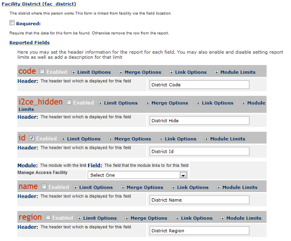
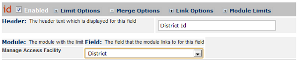

ManageAccessFacility -- Limit Reports by User
=============================================

This document applies to iHRIS Manage 4.1 or later.

Once you have [[ManageAccessFacility -- Create Facility/Geographic Restricted Users|created a restricted access user]], you can set up reports to be automatically limited by the same restrictions.  To do this, the report must have all fields that any users may be assigned for limited access.  By default, you can assign a country, region, district, county or facility to a user.  You may not use all of these however.  For example, let's say that you only need district level access and no other levels will be used.  In this case you only need to have a district form or field in your report.

Linking the Report Field to the Manage Access Facility Module
^^^^^^^^^^^^^^^^^^^^^^^^^^^^^^^^^^^^^^^^^^^^^^^^^^^^^^^^^^^^^

When you're editing the report, you can select which field is linked to the Manage Access Facility module.  This limit will apply to all views of this report.  For this example, we only need to link to the district so we can add the limit to the Staff List report (from the demonstration site):

* Go to *Configure System*  -> *Reports* .
* Click on the *Edit*  link under **Staff List** .
* Click on *Reported Forms*  to open up the list of forms.
* Click on *Facility District (fac_district)*  to open up the form details.
* Click on *Report Fields*  to see the list of fields.
* Check the box next to **id**  to enable the id field for the district.
* Click the *Module Limits*  link next to the **id**  to see the Module limit details.

* Now select **District**  next to *Manage Access Facility* .

* Scroll down to the bottom and click the *Update*  button.

Now any user that is linked with a district will only see records from that district in any Staff List reports.  You will need to do the same thing with any other reports you want to limit by default.  If you also limit by region or facility you will need to make sure your report includes those forms or fields so you can link them to the **Region**  or **Facility**  in the Manage Access Facility module.

[[Category:Developer Resources]]
