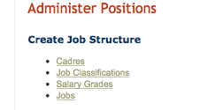

Remap Data Fields
=================

In development branch of iHRIS we have introduced a new administrative feature that allows you to remap data fields.  This functionality is only available to a user with the administrator's role.  This will be available in the next release of iHRIS.

The remapping data feature is part of a new "auto list" functionality that has not been fully integrated into the iHRIS software.  This integration will come with the 4.2 release.  In the meantime the functionality is still available.

Accessing the Auto List
^^^^^^^^^^^^^^^^^^^^^^^
If you are accessing your site at for example 
 http://localhost/ihris-manage/index.php
then you can access the "auto list" page at
 http://localhost/ihris-manage/index.php/auto_list

Remapping A Field
^^^^^^^^^^^^^^^^^
In this example, we will suppose that we have two jobs "Registered Nurse" and "General Nurse" that have been used but they are really the same thing and we want to use "Registered Nurse" instead of "General Nurse."   What we will want to do is to "remap" every form field that points to "General Nurse" to use "Registered Nurse" instead.

Selecting the Job form
~~~~~~~~~~~~~~~~~~~~~~

Once you have accessed the auto list page, you want to go to the job form. 

Selecting the value to remap
~~~~~~~~~~~~~~~~~~~~~~~~~~~~

Once we have selected the job form, we want to select the "General Nurse" job to remap. 

.. image:: images/Auto list 2.png
    :align: center

 

  

Once you have selected the "General Nurse" job, you will be taken to the overview page.&nbsp; Click on the link "Set Remapping Data"  

  

.. image:: images/Auto list 3.png
    :align: center

 

  

Remapping the Value
~~~~~~~~~~~~~~~~~~~

Clicking on the "Set remapping data" link will take you the page where you can select the new value that you want the data fields to point to, "Registered Nurse" 

  

.. image:: images/Auto list 4.png
    :align: center

 

 

Performing the data remap
~~~~~~~~~~~~~~~~~~~~~~~~~

Once you have selected the new value for the mapped fields, you will be returned to the overview of the "General Nurse."&nbsp;&nbsp; Here you will see a link that will allow you to map any forms that link to&nbsp;"General Nurse".&nbsp;&nbsp; In this case it says "Remap field position in job (1 matches)"&nbsp; meaning that there is one poisition linking to the General Nurse job that should be remapped to "Registered Nurse"  

  

.. image:: images/Auto list 5.png
    :align: center

 

  

Clicking this link will take you to the page where all of the data remapping occurs. 

.. image:: images/Auto list 6.png
    :align: center

 

  

  

[[Category:Developer Resources]]
