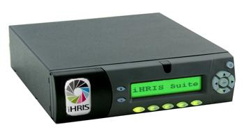

IHRIS Appliance
===============

The iHRIS Appliance is our low-cost and low-maintenance solution for providing the iHRIS Suite in low-resourced areas.

The appliance is a small computer with no monitor, mouse, or keyboard but instead has only a small LCD screen and few command buttons. The cost as of this writing for appliance, UPS, and flash drive back-up solution is ~$650 USD. The appliance comes pre-loaded with all the Linux software necessary to run the iHRIS suite as well as customizations requested by the customer and, if available in electronic format for import, the customer’s data. The ICT support must configure the appliance on their LAN following basic instructions provided and direct users to the appropriate URL. Any user on the LAN may then use the iHRIS suite with an internet browser. 

Technical [[Installing on Mini-Box|information]].

<videoflash>6h79JeTiSQg</videoflash>

