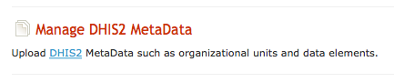
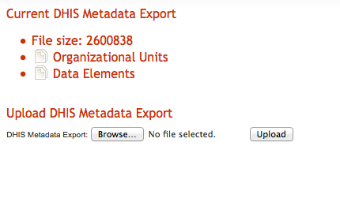
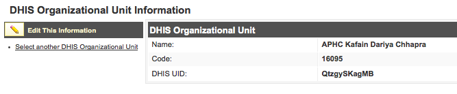
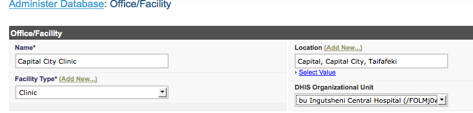

Linking iHRIS Facilities and DHIS Organizational Units
======================================================

The 4.1 series development code now has the ability to rapidly link iHRIS facilities with the DHIS2 organizational units.  This functionality will be a part of the next release, 4.1.7.  This is accomplished with the "DHIS Facility Map" modules.

Reporting to DHIS2
^^^^^^^^^^^^^^^^^^
This module is intended to facilitate reporting of aggregate data, such as the number of health workers at a clinic, from iHRIS to DHIS2.  

Once the facilities in iHRIS are linked with the DHIS2 metadata, the DHIS2 facility codes and uid will be available in your report.  In your report relationship, once you have joined in the iHRIS Facility, simply join in the DHIS2 Organizational Unit to make these fields available.

You may want to develop and XSLT to transform the iHRIS report into the DHIS2 DXF format.  Discussion on how to do this is out of scope for this document, however you may wish to view this  `related example <http://bazaar.launchpad.net/~intrahealth+informatics/ihris-student-tracking/trunk/view/head:/modules/DHIS2_StudentStatus/sources/student_status.xsl>`_ 

Enabling the Module
^^^^^^^^^^^^^^^^^^^
You have two ways to enable the module.  Either through the web interface or by adding the following line to your site customization XML file.

.. code-block:: xml

     <enable name="DHIS_FacilityMap" />
    

To enable this module in the web interface, do the following:

* Click on "Configure System"
* Click on "Configure Modules"
* Click on "Sub-Modules" to the right of "iHRIS Common"
* Click on "Sub-Modules" to the right of "DHIS Metadata"
* Check the box to the left of "DHIS Facility Map"
* Click on the "Enable" button

Exporting DHIS Metadata
^^^^^^^^^^^^^^^^^^^^^^^
To obtain the DHIS2 metadata export, see the  `DHIS2 documentation <http://www.dhis2.org/doc/snapshot/en/user/html/ch19.html#d5e2772>`_ .  You will want to select the "XML" format and "Uncompressed" and you should obtain a file "Export.xml."

Uploading DHIS2 Metadata
^^^^^^^^^^^^^^^^^^^^^^^^
The DHIS Facility Map module makes use of the DHIS Metadata module which loads in the "Organizational Unit" and "Data Element" metadata from your DHIS2 installation.  Once the DHIS2 module is enabled, you will see a new option under "Configure System" called "Manage DHIS2 MetaData"

 
Clicking on this link will take you to a page where you can upload the DHIS2 metadata export. 

 

Once you have uploaded the DHIS2 Metadata, clicking on the "Organizational Units" and "Data Elements" links will show you the available metadata from DHIS2.  For example:

 

Notes:

* it may take a short amount of time for the caches of the DHIS metadata to be rebuilt after an upload.
* the maximum file upload size in php.ini as well as max post size need to be at least as big as the size of the Export.xml
* the max_allowed_packet in mysql's my.cnf needs to be at least as big as the size of Export.xml

DXF 2.0 File Format
^^^^^^^^^^^^^^^^^^^
Currently, the DHIS MetaData module is configured to work with DHIS2 Meta Data Exports in the DXF 1.0 File Format.  If you have a metadata export in the DXF 2.0 file format, you will have to a few adjustments to the configuration.  The easiest way to do this is to use the Magic Data Browser to set these values for Data Elements:

* /modules/forms/forms/dhis_data_element/storage_options/XML/namespaces/dxf = http://dhis2.org/schema/dxf/2.0
* /modules/forms/forms/dhis_data_element/storage_options/XML/basequery = /dxf:metaData/dxf:dataElements
* /modules/forms/forms/dhis_data_element/storage_options/XML/id = attribute::id
* /modules/forms/forms/dhis_data_element/storage_options/XML/fields/name = attribute::name
* /modules/forms/forms/dhis_data_element/storage_options/XML/fields/code = attribute::id
* /modules/forms/forms/dhis_data_element/storage_options/XML/fields/dhis_uid = attribute::id
And for Org Units

* /modules/forms/forms/dhis_orgunit/storage_options/XML/namespaces/dxf = http://dhis2.org/schema/dxf/2.0
* /modules/forms/forms/dhis_orgunit/storage_options/XML/basequery = /dxf:metaData/dxf:organisationUnits
* /modules/forms/forms/dhis_orgunit/storage_options/XML/id = attribute::id
* /modules/forms/forms/dhis_orgunit/storage_options/XML/fields/name = attribute::name
* /modules/forms/forms/dhis_orgunit/storage_options/XML/fields/code = attribute::code
* /modules/forms/forms/dhis_orgunit/storage_options/XML/fields/dhis_uid = attribute::id

Linking Facilities
^^^^^^^^^^^^^^^^^^
Once you have uploaded the DHIS2 metadata, you can link this facilities in iHRIS. 

* Click the "Administer Database" section
* Click on "Office/Facility"
* select the facility that you wish to link
* Click on "Update This Information"
* Select the DHIS2 Organizational Unit you wish to link to
* Click "Confirm"
* Click "Save"

HTML Templates
^^^^^^^^^^^^^^
If your site customizations include either of the files "view_list_faciltiy.html" or "lists_form_facility.html"  you should add the following lines:

.. code-block:: xml

    
     
    
    

which will display the field which links the DHIS2 Organizational Unit to the iHRIS Facility forms.  

You can see an example of this  `here <http://bazaar.launchpad.net/~intrahealth+informatics/ihris-common/4.1-dev/view/head:/modules/Facility/templates/en_US/lists_form_facility.html>`_  on lines 9-11. 

If your site does not include either of these html templates, you should not need to make any changes.

