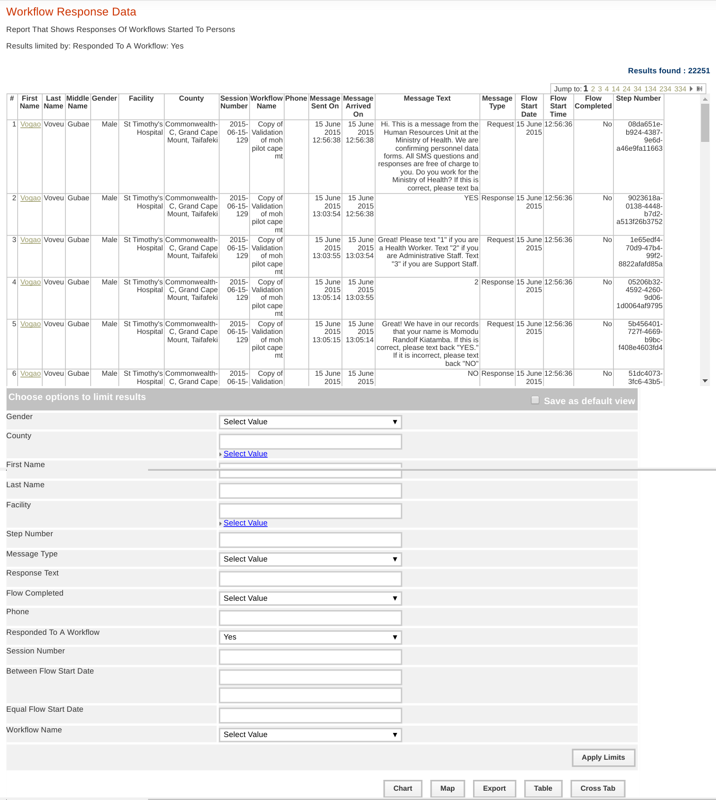
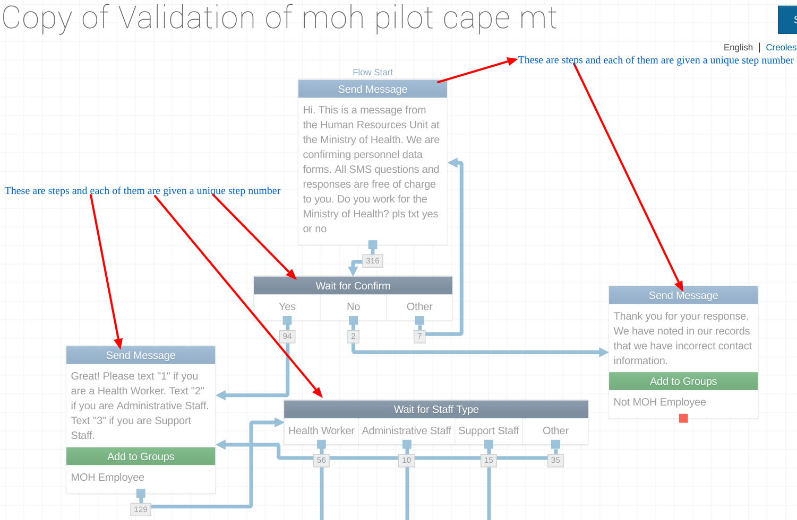
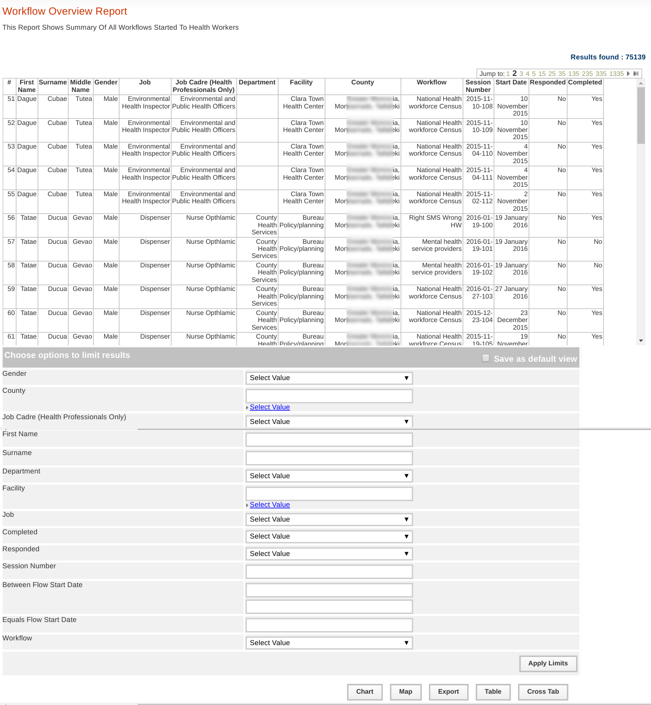

Using mHero
===========

Sending Messages
^^^^^^^^^^^^^^^^

Introduction
~~~~~~~~~~~~
With mHero,sending messages requires creating a workflow from an Interactive Messaging Application like  `Rapidpro <http://docs.rapidpro.io/#article_775401>`_  and this workflow will then be accessible in  `iHRIS <http://www.ihris.org/>`_  or any Human Resource Health Information System (HRHIS) which is  `CSD <http://wiki.ihe.net/index.php?title=Care_Services_Discovery>`_  compliant for sending to a health worker. This article will be based on iHRIS as an example of a Human Resource Health Information System which is compliant to CSD and Rapidpro as an example of an Interactive Messaging Application.
There are two ways for starting a workflow through iHRIS,one is called Bulk Workflows (starting a workflow to multiple participants) and the other one is individual workflow (starting a workflow to one participant).

Starting A Workflow in iHRIS
~~~~~~~~~~~~~~~~~~~~~~~~~~~~
<ol>
<li>
 **Starting a workflow through Bulk Workflows ** 
To send a workflow to multiple participants follow these steps:
<ul>
<li>click the home button and then click mHero link which is located at the bottom, as indicated by the blue arrow in the picture below: 

</li>
<li>
A window will open that has a section to start Bulk Workflows. Select any report under Bulk Workflows section and then click the "Select Participants" button to load all health workers. 

</li>
<li>
At the bottom of the report there are filters which can be used to filter health workers to be sent a workflow.
Select a workflow that should be started (located at the very bottom) and then click the "Start Flow" button 

</li>
</ul>
</li>
<li>
Starting a workflow through individual workflow 
This is done by accessing a health worker's profile. These are the steps to start a workflow to an individual participant. 
<ul>
<li>
Click on the Search Records link which is located at the left hand panel,then click the Search People link. Use filters to search for a specific health worker and then click the name of the health worker to open the profile.

</li>
 
<li>
Under the health Worker profile,click the mHero logo which is located at the top right corner.

</li>
 
<li>
Select a workflow to be started to this health worker and then click the Start Workflow button.

</li>
</ul>
</li>
</ol>

Workflow Results Pulling And Results Reporting
^^^^^^^^^^^^^^^^^^^^^^^^^^^^^^^^^^^^^^^^^^^^^^

Introduction
~~~~~~~~~~~~
When a workflow is started in iHRIS, all the SMS communication exchanged between a Health Worker and Rapidpro are stored inside Rapidpro.These SMS need to be pulled into iHRIS for reporting.

Pulling Workflows Results From Rapidpro
~~~~~~~~~~~~~~~~~~~~~~~~~~~~~~~~~~~~~~~
The following steps outlines how Workflow results can be pulled from Rapidpro into iHRIS: 
<ol>
<li>Click the Home button and then click the mHero link located at the bottom of the home page</li>
<li>Under the Generate Workflows Results section,select a workflow to generate its results or select the "All Workflows" option to generate results of all workflows for all health workers involved</li>
<li>Click the Generate Results button to start the process</li>
</ol>

mHero Reports in iHRIS
~~~~~~~~~~~~~~~~~~~~~~
 At the time this article was created there were three mHero reports as listed below:
<ol>
<li>Workflow Response Data</li>
<li>Workflow Overview Report</li>
<li>Health Worker Initial Response Report</li>
</ol>
These reports belong to the mHero Reports section which can be accessed by clicking the View Reports link.

Workflow Response Data
----------------------
This report shows a series of messages that were sent to health workers (grouped in a workflow) and responses to those messages by health workers. Below is a sample of a Workflow Response Data Report;

<ul>
<li>First Name: Is the initial name of the health worker.</li>
<li>Last Name: Is the surname of the health worker.</li>
<li>Middle Name: Are other names of a health worker.</li>
<li>Session Number: Is a unique number that is given to a group of health worker participated in a single workflow start. This is number is generated everytime a workflow is started and it is assigned to everyone that was involved in that particular workflow. The session number is useful in a situation where one workflow have been started multiple times in a single day,you can filter by session number to obtain health workers who were involved in each different run of the same workflow. The session is in the format YYYY-MM-DD-XX,where YYYY is the year,MM is the Month,DD is the day for which the workflow was started and XX is the unique number which is generated every time a workflow is run.</li>
<li>Workflow Name: Is the name of the workflow that was started to a health worker.</li>
<li>Message Sent On: Is the date and time for which a particular message was sent to a health worker.</li>
<li>Message Arrived On: Is the date and time for which a particular message was delivered to a health worker.</li>
<li>Message Text: Is the text message that was sent or received to/from a health worker.</li>
<li>Message Type: This can be 'Request' or 'Response',Request is the message that was sent to a health and Response is the message that was received from a health worker.</li>
<li>Flow Start Date: This is the date for which a workflow was started to a health worker.</li>
<li>Flow Start Time: This is the time for which a workflow was started to a health worker.</li>
<li>Flow Completed: This shows whether or not a health worker responded to all messages of a workflow. It is Yes if a workflow was complete and No if a workflow was not complete.</li>
<li>Step Number: Every Message and expected Response that is created in Rapidpro,it is called a step and is given a unique number called step number. Have a look at the picture below 

 
As can be seen in the image above, each part of a work flow is given a unique step number. , which can be you can use step number to get messages that corresponds to a particular step for all health workers. For example, if you are interested in knowing how health workers responded in a particular step, you can filter the report by that particular step number. From the screenshot above,Below are the responses to the message "Hi. This is a message from the Human Resources Unit at the Ministry of Health.   We are confirming personnel data forms. All SMS questions and responses are free of charge to you. Do you work for the Ministry of Health? pls txt yes or no" 

 
</li>
</ul>

Workflow Overview Report
------------------------
This report shows an overview of various workflows started to health workers. The report can show whether or not a health worker responded to a workflow, whether a health worker has completed a workflow, etc. Below is a sample screenshot of this report: 

<ol>
<li>The column titled "Responded" has 'Yes' or 'No' values which indicate whether or not a health worker responded to a workflow. The value will be Yes if a health worker responded to at least one message,regardless of whether or not the health worker has completed the workflow.</li>
<li> The column titled "Completed" has 'Yes' or 'No' values which indicate whether or not a health worker has completed a workflow.</li>
</ol>
<b>NB:</b> 
<i>There are workflow which do not require a health worker to give any response, such as single message notifications, which are sent to provide health workers with information. These type of workflows will be displayed in the report with Completed='Yes' but Responded='No' because the workflow was complete but the health worker didn't respond, as the nature of the workflow does not require any response.</i>
Analysis of the report can be done by using the filters which are found at the bottom of the report. If the name of the workflow is selected from the Workflow filter and then select 'Yes' to Responded filter and 'No' to Completed filter then the report will display a list of health workers who gave response(s) to a selected workflow but didn't complete the workflow.

Health Worker Initial Response Report
-------------------------------------
This report shows a list of health workers who has responded to at least one workflow which was started to them. Below is a sample of this report 

Related Pages
~~~~~~~~~~~~~
[[MHero Installation and Configuration]]

