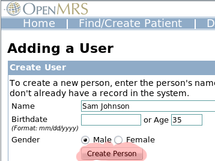

LMI - Administrative Documentation
==================================

= Introduction =
While most of the administrative functions take place within OpenMRS, it is good to point to their official documentation. The  `OpenMRS Documentation Wiki <http://openmrs.org/wiki/Documentation>`_  is a dynamic source of information and worth checking from time to time as it grows. The Following sections contain information specific to the LMI Community Health Worker Data Collection System (CHWDCS), in particular Adding Community Health Workers, Viewing Results, and Administrating Users & Privileges in the system.

= Adding CHWs with the GUI =

.. image:: images/Manage_users.png
    :align: center

OpenMRS uses the same "Person" object to hold information for both patients and users. Users are granted access depending on what roles and privilages they have (see below).  If you have your patients already in OpenMRS, then it is likely that your Community Health Workers are among them.

In any case, you can add the CHW role to your existing patients or create entirely new users using the following process.

To add a Community Health Worker, log into OpenMRS as an administrator and click on the "Administration" menu.

From there, you will see see a list of options.  One of these will be "Manage Users".  Click it.

A screen listing the current users will appear.  At the top is a link to "Add User

You'll be prompted to enter a name, gender, and birthday or age.  This information is required because OpenMRS creates a unique "Person" object for each user.  Person objects can be both a Patient and a User, so OpenMRS needs to ensure that the user you are about to create doesn't exist or select the already existing Person and make it a User as well.  Click "Create Person" to continue.

OpenMRS displays a form where you can fill in a username and password.  In addition to filling these in, be sure to select "Community Health Worker" under the "Roles" area.

After submitting this form, the new user will be ble to log in to the LMI form and start interviewing villagers.

= Adding CHWs via the PHP library =

When you need to add CHWs in bulk, it is easier to use the PHP library.  If you know your CHWs are not already in the system, then all that needs to be done is to create a person, assign a username and password and the CHW role:

.. code-block:: php

    require("OpenMRS.php");
     
    $o = new OpenMRS($dbuser, $dbpass, $dbname, $dbserver);
    $person = new OpenMRS_Person($o);
    $person->birthdate = "1980-01-01";  /* Person Objects have to have a minimal amount of data */
    $user = $person->make_user();
    $user->username = "joe";
    $user->set_password("password");
    $user->add_role("Community Health Worker");
    $user->commit();
    

Using a method like this and input from a spreadsheet, large numbers of users could be created rapidly.

= Viewing Results =

Individual patients can be found and their encounters displayed easily.

Ad-hoc reports can be built using the Cohort builder.

Individual Patients
^^^^^^^^^^^^^^^^^^^

If you want to examine a particular patients history, this is the best option.

The navbar for OpenMRS contains a link titled "Find/Create Patients".  Clicking on this brings you to the "Patient Search" page.  In the "Find Patient" box, typing a patient's name, or if you know it, his or her identifier, will show a dynamically changing list of matching patients.

Selecting a patient from the list brings up the patient dashboard where all the information about the patient can be found.

Of particular interest to the LMI project is the "Encounters" tab which will display each instance a form was filled out for the patient.

Ad-hoc Reports
^^^^^^^^^^^^^^

(For reporting purposes, it is important to understand that OpenMRS only records "Observations" for patients.  In order to store information on the CHWs forms -- when they are acting as a provider and not a patient -- the system has to treat the forms as if they are patient forms.  This (ab)use of OpenMRS's database is necessary to keep all the data in one place.)

Creating Ad-hoc reports with the Cohort builder is a good way to get information such as "Which CHWs have made the most Family Planning Referrals?".

After clicking "Cohort Builder" in the navbar, a tabbed display appears from which different criteria can be selected to find groups of people in the database.

If you know which indicators you're interested in, the best place to start is on the Concept/Observation tab.  After selecting a concept (such as "FAMILY PLANNING REFERRALS") a dialog box will appear.  Here you can specify the date ranges when and values to search for.

Combining the concepts tab with the other tabs (such as "Patient Attributes" to gather gender information) makes it possible to build complex ad hoc reports.  These reports can then be saved for re-use.

=Controlling User Accounts & Privileges=

OpenMRS uses privileges and roles to control access to data within the system.  Privileges define what can or cannot be done in the system (e.g., *Edit People*  or *Add User* ) while Roles are used to group privileges into more manageable grouping.  To make the system easier to manage, roles can contain other roles as well as privileges.  Roles inherit all privileges that exist within the child roles.

We'll use this example: you are working with several privileges related to patient data &mdash; e.g., *View Patient* , *Edit Patient* , and *Add Patient* .  The *View Patient*  privilege lets users look at patients in the system, the *Edit Patient*  privilege lets users edit information about existing patients, and the *Add Patient*  privilege allows users to create a completely new patient record within the system.  Now imagine that you need to assign the proper rules to three people: Mary the Medical Student, Bob the Data Assistant, and Erica the Data Manager.  You want medical students to be able to view patients, but not edit or add them.  Data assistants should be able to not only view, but also edit patient data.  And you want your data managers to be able to create new patients within your system.  In the simplest method of assigning privileges you could individually assign the privileges:

{| cellspacing=0 cellpadding=5
! User !! Privilege(s)
|- valign=top style="background:#EEE"
| Mary the Medical Student || View Patient
|- valign=top
| Bob the Data Assistant || View Patient Edit Patient
|- valign=top style="background:#EEE"
| Erica the Data Manager || View Patient Edit Patient Add Patient
|}

However, with this scheme, each time you add a new user to the system, you will have to make sure that you assign all of the proper privileges to the user.  As your system grows, you may have dozens of privileges to manage for many of your users and the management will become very difficult.

Now, let's introduce roles.  We will define a role for each type of user we need.  In this example, we have a medical student, a data assistant, and a data manager.  Each one of these could be a role.

{| cellspacing=0 cellpadding=5
! Role !! Privilege(s)
|- valign=top style="background:#EEE"
| Medical Student || View Patient
|- valign=top
| Data Assistant || View Patient Edit Patient
|- valign=top style="background:#EEE"
| Data Manager || View Patient Edit Patient Add Patient
|}

This looks very similar to the first case, except we are now assigning privileges to roles instead of specific users.  Why bother?  The benefit comes as you add more users to the system.  Now when you need to add a new user, say John the Medical Student, you need only assign a single role to that user.

{| cellspacing=0 cellpadding=5
! User !! Role(s)
|- valign=top style="background:#EEE"
| Mary || Medical Student
|- valign=top
| Bob || Data Assistant
|- valign=top style="background:#EEE"
| Erica || Data Manager
|- valign=top
| John || Medical Student
|}

Now, by defining the main roles for users of your system and assigning users to those roles, you have a much easier system to manage and users will automatically inherit all privileges given to their role(s).  Of course, some users will have multiple roles.  You can also assign specific privileges to users in special cases.   Now, let's take this process one step further.  While it may not seem necessary in this simple example, as your system grows, you will likely end up with a large number of different roles.  Very often, certain roles can be defined as a combination of other roles.  In our example, a Data Manager oversees the Data Assistants and, therefore, should have all of their privileges *plus*  some additional privileges.  So, let's redesign our roles slightly to show how this might work.

{| cellspacing=0 cellpadding=5
! Role !! Inherit Privileges from Role(s) !! Privilege(s)
|- valign=top style="background:#EEE"
| Medical Student || || View Patient
|- valign=top
| Data Assistant || || View Patient Edit Patient
|- valign=top style="background:#EEE"
| Data Manager || Data Assistant || Add Patient
|}

You can see that the Data Manager role is more clearly defined as a *Data Assistant*  with the extra ability to add patients to the system.  In addition, if you should change or enhance the privileges of the *Data Assistant*  role at any time in the future, the *Data Manager*  will *automatically*  adapt to those changes &mdash; for example, if you decided a month later to allow any *Data Assistant*  to *Edit Encounters*  (by adding the *Edit Encounters*  privilege to the *Data Assistant*  role), the *Data Manager*  role would automatically gain the ability to edit encounters as well.

Common scenarios would be to define roles like *Provider*  that is inherited by *Physician* , *Nurse* , *Clinical Officer* , etc.  You can then control most of the privileges within the *Provider*  role and those changes will effect all types of providers in the system.  If you find that you have to go through multiple roles and edit them to make a change, then you could likely benefit from defining a role that applies to all of the roles and/or users you are editing and make define a new role to manage those privileges.  For example, if you found that you were constantly editing roles like *Provider', * Data Assistant'', and *Caregiver*  whenever you adjusted how patient data are allowed to be viewed in your system (i.e., affecting all users/roles that are allowed to view patient data), you might benefit from creating a new *Patient Data Viewer*  role, assigning it to each of those other roles, and then managing the privileges in one place (under that new role).

Some privileges are built into the system and cannot be deleted.  Other privileges may be added by modules.  It is unlikely that you will be adding new privileges yourself, since privileges are only useful when they are understood and used by the system.  On the other hand, you will definitely be creating new roles to fit your needs and will be managing privileges within those roles.

There are some special roles that are predefined within OpenMRS and cannot be deleted: *Anonymous* , *Authenticated* , *Provider* , and *System Develope* r.  Any privileges granted to the *Anonymous*  role will be available to people without logging into the system.  Generally, *Anonymous*  privileges are kept very restricted, since patient information might otherwise be compromised.  Privileges granted to the *Authenticated*   role are granted to anyone that logs into your system, no matter what other role(s) they might be assigned.  Granting privileges to the *Authenticated*  role is an easy way to grant privileges to all users of the system.  *Provider*  represents the most basic care provider and can serve as the basic role from which to build specialized providers (physicians, nurses, medical students, etc.).  The *System Developer*  role is automatically granted full access to the system and should only be granted to system administrators.

Super users (system administrators) are automatically granted all privileges in the system; therefore, you must be very careful to protect your system administrator password.

----

What privileges are required for various actions?
^^^^^^^^^^^^^^^^^^^^^^^^^^^^^^^^^^^^^^^^^^^^^^^^^

* View Patients
* *Manage Relationships {{info | Manage Relationships privilege is *not* required after  `build 5050 <http://dev.openmrs.org/changeset/5050>`_ .}}
* *Patient Dashboard - View Demographics Section
* *Patient Dashboard - View Encounters Section
* *Patient Dashboard - View Forms Section
* *Patient Dashboard - View Graphs Section
* *Patient Dashboard - View Overview Section
* *Patient Dashboard - View Patient Summary
* *Print Clinical Summary
* *View Clinical Summary
* *View Concept Classes
* *View Concept Datatypes
* *View Concepts
* *View Encounter Types
* *View Encounters
* *View Forms
* *View Locations
* *View Observations
* *View Patient Programs
* *View Patients
* *View People
* *View Person Attribute Types
* *View Programs
* *View Relationship Types
* *View Relationships

* Do Data Exports
* *View Data Exports
* *Add Data Exports
* *Edit Data Exports
* *Delete Data Exports

* Work with Programs
* *Manage Programs - Required to add a new program, work flow, etc.
* *Edit Patient Programs - Required to allow a user to change the program that a patient is in.

* Tribes
* *Manage Tribes
* *Edit Person Tribe - Assign a patient to a tribe.  Only required if global property restrict_patient_attribute.tribe is set to true

This section covered under the [ `OpenMRS Public License <http://openmrs.org/wiki/License>`_ ]

