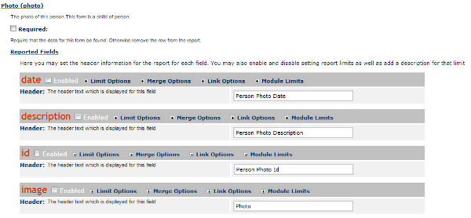
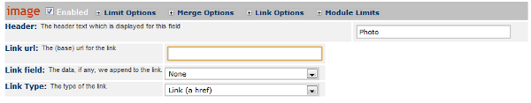
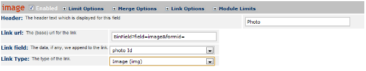

Custom Reporting -- Add Images to a Report
==========================================

This tutorial applies to version 4.0.22 and later.

This tutorial will show you how to display images in a report table view.  This does not apply to the PDF/Print view.

Setting the Link
^^^^^^^^^^^^^^^^
Any field can be displayed with a link. Form fields of type IMAGE can also be assigned to display the image inline.  This tutorial assumes you have a form with an IMAGE field in the form relationship.

Now you edit the report that is based on this relationship.  Click on the form with the image and then click on <u>Reported Fields</u>.

Enable the image field and click on **Link Options** .

Fill in the link options as follows:
;Link url : BinField?field=''field''&formid=
:The field option needs to match the name of the image field in the form.
;Link field : *form*  Id
:Select the form id for the form that has the image field.
;Link Type : Image (img)
:If you select **Link (a href)**  then a link to the image will be displayed in the report.

Click the *Update*  button at the bottom of the page to save your changes.

Update the Report View
^^^^^^^^^^^^^^^^^^^^^^

In a report view for this report, you should enable the image field.  Now when you view this report you will see the image displayed.

