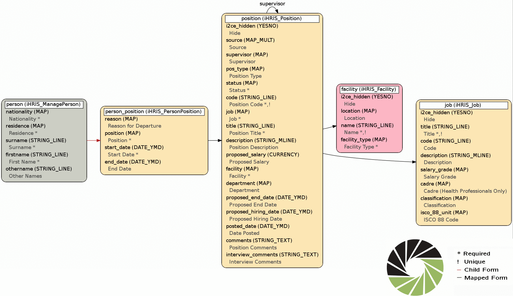
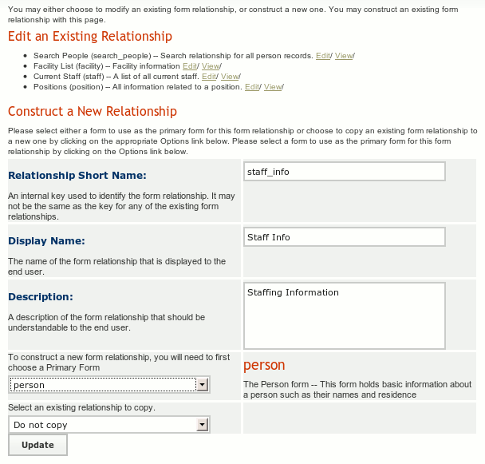
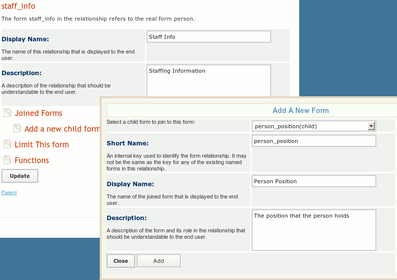
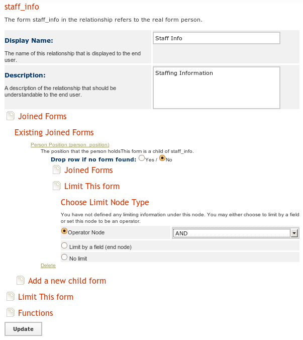
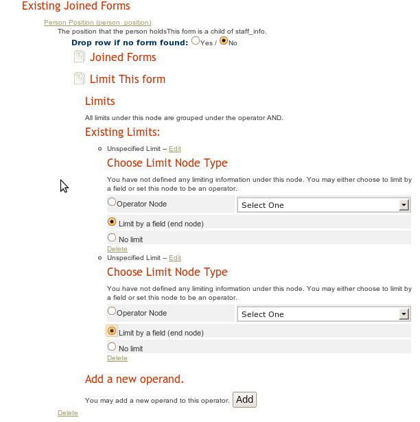
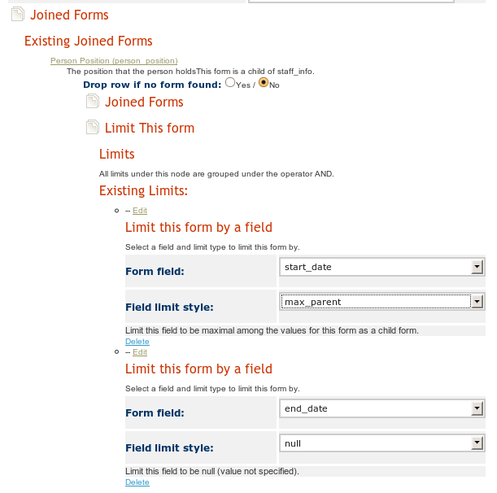
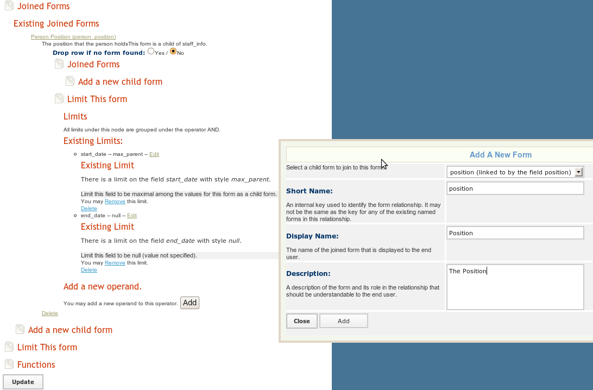

Custom Reporting -- Creating a Staff List Example
=================================================

This article describe you how to create a custom staff info report for iHRIS Manage.  This is a three step process:

* Create the custom [[Custom Reporting -- Creating Form Relationships | form relationship]] 'staff_info'.   Here you choose the forms that you are interested in and how they are related to each other.
* Create a custom [[Custom Reporting -- Creating Reports | report]] 'staff_report' based on the 'staff_info' relationship  Here you choose the fields you want for your report from the relationship you created.  You can also choose which fields to limit by for all the report views created from this report.
* Create a custom [[Custom Reporting -- Creating Report Views| report view]] for the staff report.  The various views of a report are intended for non-administrative users to view the data in the system.

Actually, this is a four step process, with the first step being to figure out which data you want and where it is stored.  Let us suppose we have the following requirement from an HR Manager to:
 Requirement: Create a staff list with the person's cadre and facility 

The Form and Field Map
^^^^^^^^^^^^^^^^^^^^^^
A good starting point is to look at the [[iHRIS Manage Form Fields | forms and fields]] and in particular the "graphic visualization" which is a map of the forms and fields in iHRIS Manage.  When we construct a form relationship, we will **join**  forms by traversing the arrows of the form field map, both forward and backward. There are two arrows in this map:

* black arrows: The source of an arrow, formA, is related to the target of the arrow form, formB,  via a mapped field.  If the arrow is not labeled, then the mapped field is also named formB. Otherwise it is the label of the arrow.  Although, formA maps to a most one instance of formB, there may be many instances of formA mapping to formB.  Thus, when yo are going backward on a black arrow, you will probably need to limit the joined form so that a unique form is chosen.
* red arrows:  The source of an arrow, formA, is the parent of the target of the arrow, formB.  FormA may have many instances of formB as a child form, but formB can only have one parent form.  Thus, when you go forward on a red arrow, you will probably need to limit the child form so that a unique child form is chosen.

Step 0: What data do you want?
^^^^^^^^^^^^^^^^^^^^^^^^^^^^^^
This is the most important step, and requires some more advanced knowledge of how the data (forms) in the system are used.  
Based on the HR Manager's requirement and the form and field we see that we need to include the following forms:

* ''facility'':  We need the name of the facility
* ''job'':  we need to know the cadre the person is working in
* ''person'': although not explicitly stated as a requirement, let us assume that the HR Manager also wanted to know the name of the people on staff
However, if we look at the data map, we see that there are no arrows that directly connect the *facility* , *job,*  and *person*  forms.  Instead we see that we need to go from the *person*  form, through the *person_position*  form to the *position*  form.  From the position form, we can join the facility and job.  Here is the relevant portion of the form field map:

Notice that there is one red arrow here, connecting the *person*  and *person_position,*   while the rest of the arrows are black.

Step 1: Create the Form Relationship
^^^^^^^^^^^^^^^^^^^^^^^^^^^^^^^^^^^^
We will create a form relationship called 'staff_info'.  The form we starting traversing our map from is called the *primary form.*   We are free to choose where we want to start the mapping from, but choosing different primary forms will produce a different data set. There are actually three main relationships that we can create here based on which primary form we choose.   

* [[#Option A:  Person Report | Option A]]: Choose the *person*  form as the primary form. Then the reports based on the relationship "staff_info" will contain everyone in the system whether or not they have a position.
* [[#Option B:  Position Report | Option B]]: Choose the *position*  form as the primary form.  Then the reports based on the relationship "staff_info" will only contain the people in the system that have a position.  Also, if there are some positions which have no people assigned to them, then  these will also show up in the report.
* [[#Option C: Current Position Report| Option C]]:  Choose the *person_position*  form as the primary form.  The the reports based on the relationship "staff_info" will only currently filled positions.

Either option can make sense and your choice depends on the requirements from the HR Manager.  Since the HR Manager did not give us enough details to go by, we will have to and ask him/her for clarification.

Option A: Person Report
~~~~~~~~~~~~~~~~~~~~~~~
Select **Configure System**  and then **Form Relationships.**  We create a report relationship called 'staff_info' and choose "person" as the primary form, enter a display name and description. Then click update.

Now that we have created the 'staff_info' relationship we can **edit**  it. Now we need to join the "person_position" form to the "position" form.  To do this click **Joined Forms**  then **Add a New Form** .  Select ''person_position (child)" as the form to add, and the the "short name" to be 'person_position.'   You should also set a display name and description for this form.

You will notice that we are traversing a red arrow forward, form *person*  to *person_position.*   By what we said above there may be many *person_position* s associated to a person, so we will need to limit the forms.  We will need to limit the *person_position*  form so that:

* The *start_date*  is maximal among all the values of the *start_date*  field for any *person_position*  that is a child of the current *person*  .  This way we get the most recent position the person has started.
* The *end_date*  is not null, so that we know that person still holds this position.
To do so, we click on **Joined Forms**  once again and select **Person Position (person_position),**  which is the form that we just added.  Now we can choose to **Limit This Form.**   Since we have two limits to place on this form, we will need to select the "Operator Node" to be "And."

Once we click the "Update" button, we can choose to **Add A New Operand.**    We will do this twice, once for the 'start_date' and once for the 'end_date.'  Once the operands have been added, we can **Edit**  each of them and select to **Limit  By A Field** :

Now click **Update**  once again.  We can now choose the two fields we want to limit by and how we want to limit them

Next, we join the *person*  form to the *person_position*  form as a parent form.  We do this by click **Joined Forms**  and then **Add A New Child Form**  underneath the *person_position*  form.  Note, we do not need to specify any limits here as we are traversing a black arrow in the correct direction.

We finish by joining the "facility" and "job" forms to the "position" form by clicking **Joined Forms**  and then **Add A New Child Form**  underneath the *position*  form.  Note, we do not need to specify any limits here as we are traversing a black arrow in the correct direction.

Variations for Option A
-----------------------

* Note: There is some potential ambiguity here.  If a person was assigned to more than one position at a time with the same *start_date* , then there will be a *person_position*  for each of the positions, so when the person_position form is joined it will choose one of person_position forms arbitrarily.  If you expect that people can have more than one position, then you should choose [[#Option B:  Position Report | option B]]
* Note: We chose to limit the *end_date*  to be not null so as to only get current positions.  If we did not set a limit on the *end_date,*  then we would get the last position the person held, regardless of whether they hold it or not.
* Note: If we selected *Drop row if no form found*  under the *person_position*  form, then if a person did not have a person_position form associated to them, they would be removed from the report.  Selecting to do so would make this a "Current Staff Report," rather than a "Person Report." We won't do this here, but you may choose to do so if this make sense for your requirements.

Option B:  Position Report
~~~~~~~~~~~~~~~~~~~~~~~~~~
Select **Configure System**  and then **Form Relationships.**  We create a report relationship called 'staff_info' and choose "position" as the primary form, enter a display name and description. Then click update.

Now that we have created the 'staff_info' relationship we can edit it. 

First, we join the "facility" form to the "position" form by the mapped field "position."   We also join the "job" form to the "position" form by the mapped field "job."
  
Next we need to join the "person_position" form as mapping to the *position*  form via the *position*  field.   In the form field map, we are traversing a black arrow backwards, so we will need to add in some limits to choose a unique *person_position*  form.  There may be many *person_positon*  forms mapping to a given *position*  as multiple people could have held the same position.  However, there should only be one *person_position*  form where the *end_date*  is null and this will correspond to the person currently holding this position.

Next, we join the *person*  form  as to the *person_position*  form as its parent form.  Since we are traversing a red arrow backwards, there is no ambiguity about which form we are joining.

Variations for Option B
-----------------------

* If we chose to "Drop Row If No Form Found"  when we joined in the *person_position*  form, then we only will show those positions which have ever been assigned to someone so it becomes more of "Filled Positions" report, although not a Current Positions report.

Option C: Current Position Report
~~~~~~~~~~~~~~~~~~~~~~~~~~~~~~~~~
Select **Configure System**  and then **Form Relationships.**  We create a report relationship called 'staff_info' and choose "person_position" as the primary form, enter a display name and description. Then click update.

Now that we have created the 'staff_info' relationship we can edit it. 

First, since we wish to only show the current positions, we will choose to limit the *person_position*  form so that the end_date is not null.

Next, we join the *person*  form which as the parent form of the *person_position*  form.  Since we are traversing a red arrow backwards, there is no ambiguity in which *person*  we are joining.

Next we join the *position*  form to *person_position*  form via the mapped field *position.*  Since we are traversing a black arrow forwards, there is no ambiguity in the *position*  form we are joining.

Next we join the *job*  and *facility*  forms to the *position*  form via their respective fields.  Again, since we are traversing a black arrow forwards, there is no ambiguity in the forms we are joining.

Variations for Option C
-----------------------

* If we chose not to use the limit *end_date*  is null, we would end up with a report in which shows the history of any position which has been filled.

Step 2: Create the Report
^^^^^^^^^^^^^^^^^^^^^^^^^

Now that we have the relationship 'staff_info' built, we can create a report from that relationship. Go to **Configure System**  and then **Reports**  and choose to create a new report, called 'staff_report' based on the 'staff_info' relationship.  When we are done you will see the zebra_staff_report table in the database. Here, we can choose the limits that we will want for the report views (below) as well as all the fields that we may want to see in a report view.   To do so, click on the "Reporting Forms" and then the "Fields" and you will be able to enable or disable fields from the relationship to include in the report.  You will also be able  to change the header text for the field and set the limits for the field.

Step 3: Create the Report View
^^^^^^^^^^^^^^^^^^^^^^^^^^^^^^
Go to **Configure System**  and then **Report Views**  and choose to create a new report view based on the report "staff_report."   Just select the fields you want to display and you are done.

