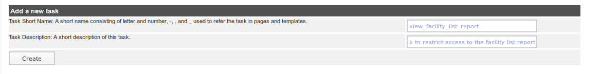
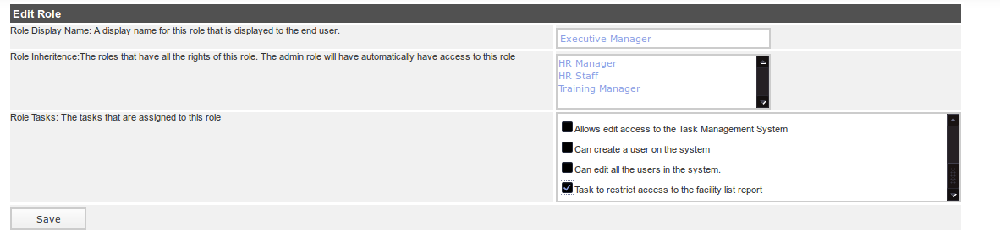
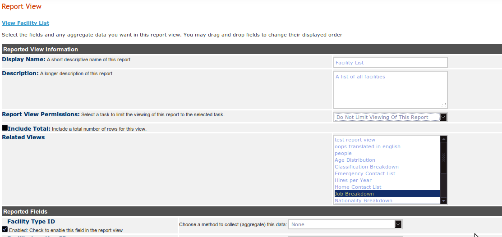

Custom Reporting -- Limit Viewing A Report By A Task
================================================

This article applies to version **4.0.16** of iHRIS and later.

You can limit displaying a report (a report view) to certain users by assigning a task to a report view.  This is a three step process.  

In the example below, we go through the three steps where we want to limit viewing the facility list to the "Executive Manager" role.  

Step 1: Create A New Task
^^^^^^^^^^^^^^^^^^^^^^^^^
The first step is to create a new task which requires the [[#Enabling the Tasks and Roles Module | Task and Roles module to be enabled]].

One the Tasks and Roles module is enabled do the following:

* Click "Configure System"
* Click "Tasks Roles"
* Click "Administer Tasks"
* Scroll down to the bottom of the page
Once you have scrolled down to the bottom of the page, you can create a new task.  Here we create a task with:

* The Name set to  "view_facility_list_report"
* The description set to "Task to restrict access to the facility list report"

 *Note:* You can also use an existing task rather than create a new one.

Step 2: Assign The Task To A Role
^^^^^^^^^^^^^^^^^^^^^^^^^^^^^^^^^
Now that we have created a new task for the report, we need to assign it to the use roles that we are interested in.

* Click "Configure System"
* Click "Tasks Roles"
* Click "Administer Roles"
* Click on the role you are interested in, in this case it is "Executive Manager"
* Under "Role Tasks" select the task you just created:  "Task to restrict access to the facility list report"
* *'''Warning''': In versions prior to *4.0.17* the "Role Tasks" field is a "multiple select".  In order to select the task you will need to:
* **scroll through the selection list until you find the task
* **hold down the **[CTRL]** key
* **click on the task
* **release the **[CTRL]** key
* **If you do not hold down the control key, you will de-select all of the other tasks already associated to that role.  If you do so accidently, reload the page before you click the "Create" button
* *In version starting with 4.0.17, there is an easier to use check box list for each of the tasks assigned to the roles.  Simply check the checkbox next to the role
* Click the "Create" button

Repeat this for each role you want to allow to view the report.

Step 3: Assign The Task To The Report View
^^^^^^^^^^^^^^^^^^^^^^^^^^^^^^^^^^^^^^^^^^
We can now assign the task to the report view we are interested in restricting access to.

* *Click "Configure System"
* *Click "Report Views" under "Manage Reports"
* *Select the task "Task to restrict access to the facility list report" under "Report View Permissions"
* *Click "Update"

Now, only the users with the role "Executive Manager" can see the facility list report.

Enabling the Tasks and Roles Module
^^^^^^^^^^^^^^^^^^^^^^^^^^^^^^^^^^^
To enable the tasks and roles module, which allows you to edit tasks and roles via the web interface, follow the following steps:

* Click "Configure System"
* Click "Configure Modules"
* Click on "Sub-Modules" to the right of "Pages"
* Select the "Roles and Tasks" module
* Click "Update"

[[Category:Custom Reporting]][[Category:Review2013]]
