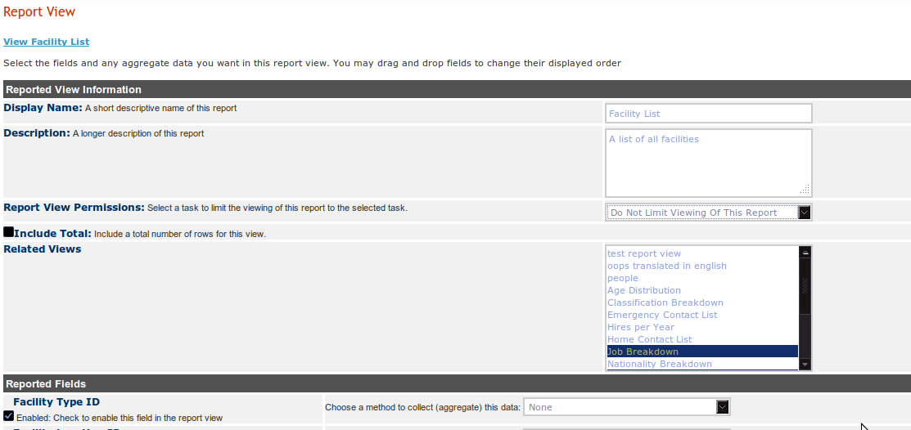

Custom Reporting -- Limit Viewing A Report By A Task - ES
=========================================================

Este artículo aplica para la versión **4.0.16**  de iHRIS y posteriores.

Puede limitar la visualización de un informe (una visualización de informe) a ciertos usuarios al asignar una tarea a una visualización de informe. Este es un proceso de tres pasos.  

En el ejemplo que sigue, avanzaremos por los tres pasos donde queremos limitar la visualización de la lista de instalaciones para el rol de "Executive Manager".  

Paso 1: Crear una Tarea Nueva
^^^^^^^^^^^^^^^^^^^^^^^^^^^^^
El primer paso es crear una tarea nueva lo cual requiere [[#Enabling the Tasks and Roles Module | Task and Roles module to be enabled]].

Una vez que el módulo Tasks and Roles esté habilitado se hace lo siguiente:

* Haga click en "Configure System"
* Haga click en "Tasks Roles"
* Haga click en "Administer Tasks"
* Vaya a la parte de abajo de la página
Una vez que esté en la parte de abajo de la página, puede crear una tarea nueva. Aquí se crea una tarea con:

* El Nombre puesto en  "view_facility_list_report"
* La descripción puesta en "Task to restrict access to the facility list report"

 *Nota:*  También puede utilizar una tarea existente en lugar de crear una nueva.

Paso 2: Asignar la Tarea a un Rol
^^^^^^^^^^^^^^^^^^^^^^^^^^^^^^^^^
Ahora que hemos creado una tarea nueva para el informe, necesitamos asignarla a los roles de uso que nos interesen.

* Haga click en "Configure System"
* Haga click en "Tasks Roles"
* Haga click en "Administer Roles"
* Haga click en el rol que le interese, en este caso es "Executive Manager"
* Bajo "Role Tasks" selecciones la tarea que acaba de crear:  "Task to restrict access to the facility list report"
* *'''Advertencia''': En versiones anteriores a la *4.0.17*  el campo "Role Tasks" es "multiple select".  Para seleccionar la tarea tendrá que:
* **buscar en la lista de selección hasta que encontrar la tarea
* **presionar la tecla **[CTRL]**
* **hacer click en la tarea
* **soltar la tecla **[CTRL]**
* **Sí no presiona la tecla control, deseleccionará todas las otras tareas ya asociadas a ese rol. Sí lo hace de manera accidental, recargue la página antes de hacer click en el botón "Create"
* *Empezando desde la versión 4.0.17, hay una lista de selección de casillas más fácil de usar para cada tarea asignada a los roles.  Simplemente seleccione la casilla junto al rol
* Haga click en el botón "Create"

Repita esto con cada rol que desee que pueda visualizar el informe.

.. image:: images/add_task_to_role.png
    :align: center

Paso 3: Asignar la Tarea a la Visualización del Informe
^^^^^^^^^^^^^^^^^^^^^^^^^^^^^^^^^^^^^^^^^^^^^^^^^^^^^^^
Ahora podemos asignar la tarea a la visualización del informe a la que nos interesa restringir el acceso.

* *Haga click en "Configure System"
* *Haga click en "Report Views" under "Manage Reports"
* *Seleccione la tarea "Task to restrict access to the facility list report" bajo "Report View Permissions"
* *Haga click en "Update"

Ahora, solo los usuarios con el rol "Executive Manager" pueden ver el informe de listas de instalaciones.

Habilitar el Módulo de Tareas y Roles
^^^^^^^^^^^^^^^^^^^^^^^^^^^^^^^^^^^^^
Para habilitar en módulo de tareas y roles, el cual permite editar tareas y roles a través de la interfaz web, siga los pasos siguientes:

* Haga click en "Configure System"
* Haga click en "Configure Modules"
* Haga click en "Sub-Modules" to the right of "Pages"
* Seleccione el módulo "Roles and Tasks"
* Haga click en "Update"

